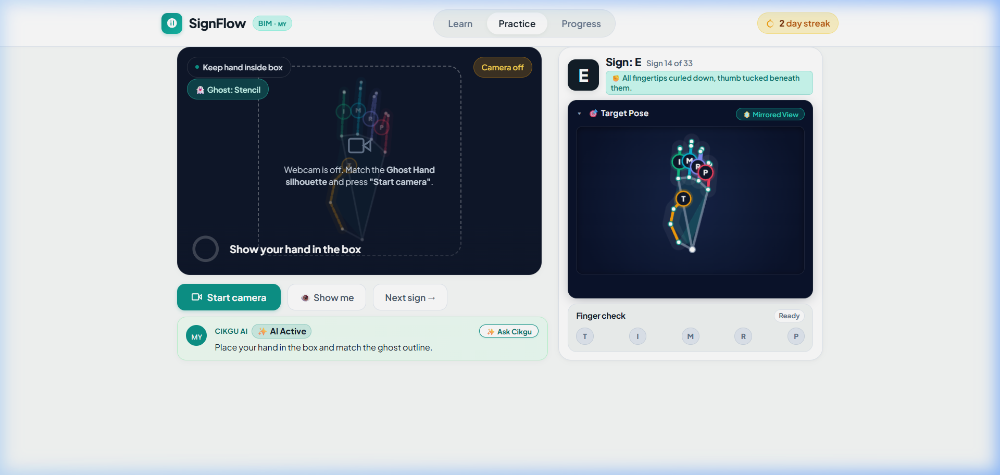

<div align="center">

# 🇲🇾 SignFlow · BIM Sign Coach
### *The Real-Time AI Driving Instructor for Malaysian Sign Language*

[](https://developers.google.com/mediapipe)
[](https://groq.com)
[](https://github.com/Risikesan26/SignFlow-AI)
[](https://github.com/Risikesan26/SignFlow-AI)
[](LICENSE)

<br/>

> **"Imagine learning to drive without an instructor telling you when to steer. That's how BIM fingerspelling used to be practiced — until SignFlow."**

<br/>



<br/>
<br/>

**[⚡ Explore Practice](#-quick-start) • [🧠 How It Works](#-how-it-works) • [📊 Dataset & Numbers](#-key-numbers--specifications) • [🇲🇾 Cikgu AI](#-meet-cikgu-ai) • [🛠️ Architecture](#-system-architecture)**

</div>

---

## ⚡ Highlights at a Glance

<div align="center">

| 🎯 **33 BIM Signs** | ⚡ **60 FPS Tracking** | 🇲🇾 **<400ms Cikgu AI** | 🔒 **100% Private** |
| :---: | :---: | :---: | :---: |
| 9 Digits + 24 Letters | In-browser MediaPipe Vision | Instant single-finger fixes | Zero video stream uploads |

| 📐 **63D Normalization** | 🔬 **Dual Verification** | 👻 **Ghost Guidance** | 🏆 **7 Skill Levels** |
| :---: | :---: | :---: | :---: |
| Distance & scale invariant | k-NN + 5-finger geometry | 25% opacity stencil overlay | Structured 5-sign bites |

</div>

---

## 💡 The Problem & The Solution

```
    THE OLD WAY                                       THE SIGNFLOW WAY
 ❌ Memorize static 2D flashcards                  ✅ Interactive real-time 3D hand skeleton
 ❌ Practice alone in front of a mirror            ✅ Ghost stencil overlay shows exact target
 ❌ Repeat undetected posture mistakes             ✅ Instant per-finger error detection (T, I, M, R, P)
 ❌ No feedback until next class                   ✅ Cikgu AI gives friendly 1-sentence micro-coaching
```

In **Bahasa Isyarat Malaysia (BIM)** fingerspelling, a difference of a few millimeters changes an entire letter:
- **Sign `E` vs. `S`**: In `E`, fingertips curl tightly with the thumb tucked below; in `S`, the thumb wraps across the front knuckles.
- **Sign `B` vs. `5`**: In `B`, fingers must be pressed together like a paddle; in `5`, they must be widely spread.

SignFlow detects these subtle variations **on every video frame** and guides learners into muscle memory.

---

## 🚀 The 4-Step Learner Journey

```text
 1. POSE               2. DETECT              3. COACH               4. MASTER
 ─────────             ──────────             ─────────              ──────────
 ✋ Position hand      🔬 21 Landmarks        💡 Cikgu AI spots      🎯 Hold pose for
    inside the box.       scanned in 60 FPS      the 1 worst finger     ~1 second. Ring
    Align with ghost.     via k-NN + rules.      & suggests a fix.      fills -> Progress!
```

1. **Visual Positioning**: Place your hand inside the camera frame. An adaptive translucent **Ghost Outline (25% opacity)** guides your hand size and placement.
2. **Dual-Engine Evaluation**:
   - **Landmark Classifier**: Evaluates your 63D coordinate vector against **4,950 prototype samples** ($k=5$).
   - **Finger Check**: Assesses all 5 fingers (**Thumb, Index, Middle, Ring, Pinky**) for extension, curling angle, and lateral spacing.
3. **Cikgu AI Micro-Coaching**: If any finger is misplaced, Cikgu AI tells you exactly which single finger to adjust in plain, encouraging language.
4. **Hold-to-Complete**: Hold the correct pose for **~1,000 ms** to fill the progress ring and automatically advance to the next sign!

---

## 🇲🇾 Meet Cikgu AI

> *"Straighten your index finger and tuck your other fingers down."*

Traditional classifiers return confusing raw diagnostic metrics (`error: index_mcp_flexion < 0.65`). **Cikgu AI** converts complex computer vision telemetry into gentle, conversational teaching tips.

### The Cikgu AI Design Principles:
- **One Fix at a Time**: Never overwhelms the learner. Even if multiple fingers need work, Cikgu AI targets strictly the **single worst finger** first.
- **Ultra-Low Latency**: Powered by **Groq LPU Cloud Inference** (`qwen/qwen3.8-27b` / `llama-3.3-70b-versatile`), returning advice in **under 400ms**.
- **Cognitive Cooldown**: Enforces a **4-second cooldown** between calls so the learner has time to adjust their hand without feeling rushed.
- **Bilingual Tutor**: Native support for **Bahasa Malaysia** and **English** (`ms` / `en`).

---

## 🛠️ System Architecture

SignFlow is built with a **zero-install, privacy-first architecture**. All video processing occurs strictly on your machine.

```text
┌────────────────────────────────────────────────────────────────────────┐
│                     USER BROWSER (Client-Side, 0 Install)              │
│                                                                        │
│   Webcam Stream (60 FPS)                                               │
│         │                                                              │
│         ▼                                                              │
│   MediaPipe Vision Bundle ──► 21 3D Coordinates (x, y, z)              │
│         │                                                              │
│         ├──────────────► Origin & Palm Normalization (63D Space)       │
│         │                     │                                        │
│         │                     ▼                                        │
│         │               k-NN Classifier (k=5, 4,950 vectors)           │
│         │                     │                                        │
│         │                     ▼                                        │
│         │               Predicted Sign Label + Match Score             │
│         │                                                              │
│         └──────────────► Geometric Rule Engine (T, I, M, R, P)         │
│                               │                                        │
│                               ▼                                        │
│                         Per-Finger Individual Validation               │
│                               │                                        │
│    ┌──────────────────────────┴──────────────────────────┐             │
│    ▼                                                     ▼             │
│ Real-Time Canvas UI                                Cikgu AI Engine     │
│ • Hand Skeleton & Bone Glow                        • Target Worst Pin  │
│ • Ghost Stencil (25% opacity)                      • POST /api/coach   │
│ • 5-Dot Finger Check (T I M R P)                         │             │
└──────────────────────────────────────────────────────────┼─────────────┘
                                                           │
                                             Fast POST (<400ms)
                                                           │
                                                           ▼
                                               ┌───────────────────────┐
                                               │      Groq Cloud       │
                                               │   LLM Inference LPU   │
                                               │ (Qwen / Llama-3.3-70B)│
                                               └───────────────────────┘
```

---

## 📊 Key Numbers & Specifications

### Dataset & Machine Learning
| Metric | Measurement | Technical Notes |
| :--- | :--- | :--- |
| **Supported Signs** | **33 classes** | Digits `1–9` + 24 static letters `A–Y` (dynamic `J`, `Z` omitted) |
| **Total Benchmark Frames** | **25,946 samples** | Annotated Malaysian Sign Language landmark dataset ([`landmarks.csv`](./landmarks.csv)) |
| **Training Set** | **20,848 samples** | 80.4% training distribution |
| **Validation Set** | **2,526 samples** | 9.7% validation distribution |
| **Test Set** | **2,572 samples** | 9.9% hold-out test set |
| **Optimized Web Model** | **4,950 vectors** | 150 curated prototype vectors per class in [`model.json`](./model.json) (6.4 MB) |
| **Vector Space** | **63 dimensions** | 21 3D landmarks ($x, y, z$) translated to wrist origin |
| **Classifier Algorithm** | **k-NN ($k = 5$)** | Sub-millisecond distance matching in pure JavaScript |

### Real-Time Performance
| Metric | Measurement | User Impact |
| :--- | :--- | :--- |
| **Tracking Pipeline** | **21 3D Joints** | Real-time palm, knuckle, and tip coordinates via MediaPipe |
| **Processing Speed** | **Up to 60 FPS** | Zero perceived lag; smooth responsive skeleton overlay |
| **Hold Completion** | **~1,000 ms** | Prevents accidental passes by requiring a stable hold |
| **AI Coach Latency** | **< 400 ms** | Instant conversational guidance via Groq LPUs |
| **Coaching Rate Limit** | **4,000 ms** | Cooldown period prevents visual and cognitive overload |
| **Curriculum Depth** | **7 Levels** | 5 signs per level for bite-sized learning progression |
| **User Privacy** | **100% Client-Side** | No video or webcam images are ever uploaded or stored |

---

## 📚 Curriculum Breakdown

Master BIM fingerspelling through 7 bite-sized levels:

```text
 🟢 LEVEL 1  │ Numbers 1 to 5        │ 1  •  2  •  3  •  4  •  5
 🟢 LEVEL 2  │ Numbers 6 to 9 & A    │ 6  •  7  •  8  •  9  •  A
 🟡 LEVEL 3  │ Letters B to F        │ B  •  C  •  D  •  E  •  F
 🟡 LEVEL 4  │ Letters G to L        │ G  •  H  •  I  •  K  •  L
 🟠 LEVEL 5  │ Letters M to Q        │ M  •  N  •  O  •  P  •  Q
 🟠 LEVEL 6  │ Letters R to V        │ R  •  S  •  T  •  U  •  V
 🔴 LEVEL 7  │ Letters W to Y        │ W  •  X  •  Y
```

---

## ⚡ Quick Start

### 1. Prerequisites
- [Node.js](https://nodejs.org/) (v18.0.0 or higher)
- A modern web browser with webcam access (Chrome, Edge, Firefox, Safari)
- *(Optional)* Free [Groq API Key](https://console.groq.com/keys) for live Cikgu AI coaching tips

### 2. Clone & Setup
```bash
# Clone the repository
git clone https://github.com/Risikesan26/SignFlow-AI.git
cd SignFlow-AI

# Create your .env file
cp .env.example .env
```

### 3. Add Your Groq API Key
Edit `.env`:
```env
GROQ_API_KEY=gsk_your_groq_api_key_here
GROQ_MODEL=qwen/qwen3.8-27b
PORT=8000
```

### 4. Launch SignFlow
```bash
node server.mjs
```

Open your browser to:
👉 **`http://localhost:8000`**

---

## 🔌 API Reference: Cikgu AI

### Endpoint: `POST /api/coach`

#### Request Payload
```json
{
  "sign": "E",
  "cue": "All fingertips curled down, thumb tucked beneath them.",
  "predicted": "S",
  "errors": [
    { "finger": "Thumb", "issue": "Thumb resting across knuckles instead of tucked beneath" }
  ],
  "lang": "en"
}
```

#### Response Payload
```json
{
  "tip": "Tuck your thumb underneath your curled fingers rather than across the front."
}
```

---

## 🤝 Contributing

Contributions are warmly welcomed! Help us expand BIM digital literacy:
1. Fork the Project (`https://github.com/Risikesan26/SignFlow-AI/fork`)
2. Create your Feature Branch (`git checkout -b feature/AmazingBIMFeature`)
3. Commit your Changes (`git commit -m 'Add support for dynamic signs'`)
4. Push to the Branch (`git push origin feature/AmazingBIMFeature`)
5. Open a Pull Request

---

## 📜 License & Acknowledgments

- Distributed under the **MIT License**.
- Built with Google [MediaPipe Vision](https://developers.google.com/mediapipe).
- Powered by high-speed inference on [Groq](https://groq.com).
- Dedicated with ❤️ to the Malaysian Deaf & Hard-of-Hearing community and all BIM learners.
